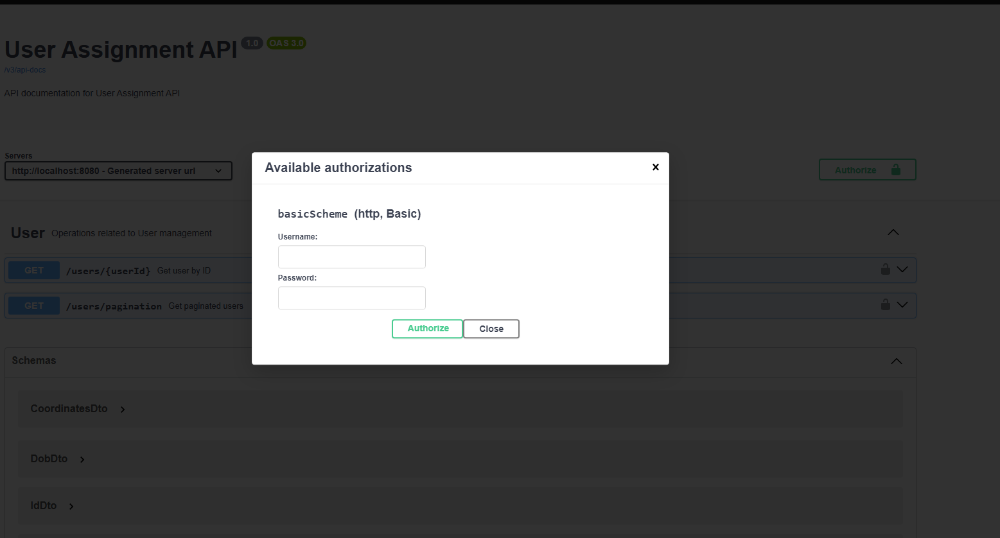
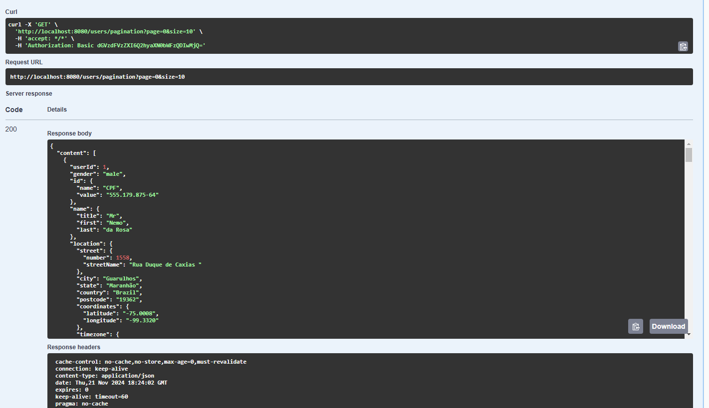
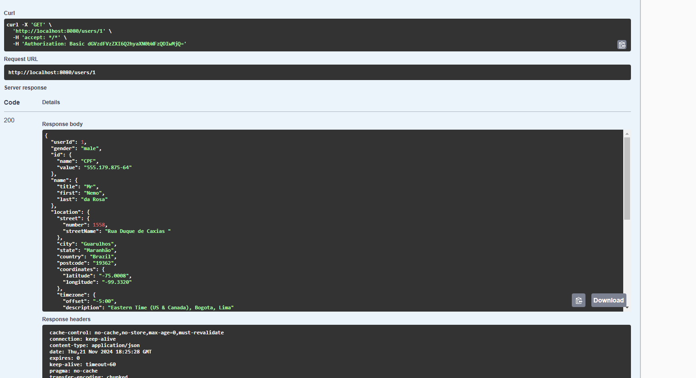
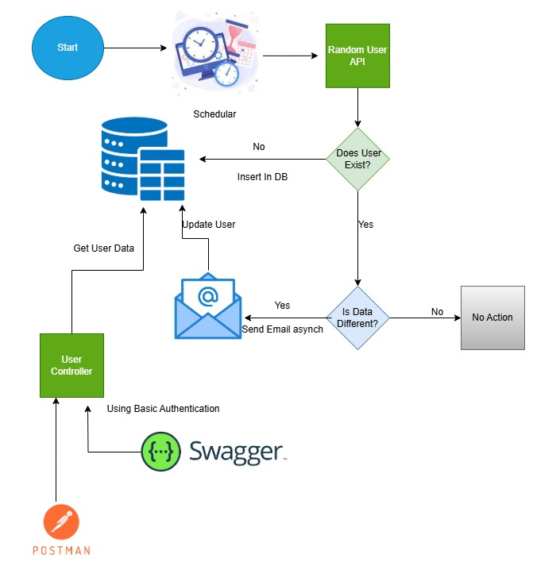

### Overview
This Spring Boot application implements a scheduled task that periodically fetches random user data from an external API, checks if the user exists in the database, and updates the database accordingly. If a user's data has changed, an asynchronous email is sent to notify them. The application also supports Basic Authentication, includes JUnit tests for functionality validation, and uses logging for monitoring and debugging. 
Swagger is integrated to provide interactive API documentation.
This README provides an overview of the system components, describes the flow of the application as depicted in the flow diagram, and explains the testing and logging functionalities.

## Prerequisites
- Spring Boot 3.3.5
- Maven   
- SqlLite Db
- Java 21.0.0

## Maven Dependencies
- spring-boot-starter-data-jpa
- spring-boot-starter-mail
- spring-boot-starter-security
- spring-boot-starter-web
- spring-boot-starter-test
- sqlite-jdbc
- openapi-spring-boot-starter
- spring-boot-starter-test
- Lombok

# Key Components

##  Scheduler
- The scheduler runs periodically (e.g., every minute) and triggers the process of calling the RandomUser API to fetch new data.
- The scheduler invokes the RandomUser API and updates the user database if necessary.

## User Service
- The User Service handles the core business logic.
- Calls Random User API which gives random user data each time.
- Checking if a user already exists in the database by phone or cell.
- Comparing the fetched data with the existing data.
- Inserting new users into the database if they don’t exist.
- Sending email notifications asynchronously if there are changes in the user data.

## Database Repository
- The Repository interacts with the database using JPA. It handles searching for existing users based on phone or cell and inserting new user data when necessary.
- It handles database-related operations such as querying and saving user data. 
   
## Email Service
- The Email Service sends asynchronous email notifications to users when their data is updated.
- If changes are detected in a user’s data, the Email Service sends an email to notify them of the update.

## Basic Authentication
  The application uses Basic Authentication to secure access to the API endpoints.
  Only authenticated users are allowed to access protected endpoints like retrieving or updating user data. Credentials are specified in the application.properties file. 
   
## Swagger API Documentation
   Swagger is integrated to provide a user-friendly interface for API documentation and testing.
   Swagger allows developers to test API endpoints interactively, such as viewing user data or inserting new users.
   The Swagger UI can be accessed at http://localhost:8080/swagger-ui.html.
- Basic Authentication is required to access the Swagger UI. The default credentials are:
  - Username: testUser
  - Password: Christmas@2024
  
- After entering the credentials, the Swagger UI will be displayed, allowing users to interact with the API endpoints.
  
- The Swagger UI for pagination endpoints is shown below.
 
  - default page number is 0 and default page size is 10.
- The Swagger UI for fetching a user by ID is shown below.

# JUnit Testing
  Unit tests are implemented using JUnit to validate the functionality of the application.
  The JUnit tests ensure that critical parts of the application, such as data comparison, insertion logic, and email notifications, are functioning correctly.

# Logging
   The application uses logging to monitor its activity, detect issues, and facilitate debugging.
   Logs are generated at key points in the application flow, such as when fetching data, updating users, sending emails, and during error handling.

# Flow Diagram
The flow diagram below illustrates the sequence of actions performed by the application when the scheduler runs.

# Note
One has to make changes in application.properties file to run the application.

## Application Name
- spring.application.name=User

## Database Settings
- spring.datasource.url=jdbc:sqlite:./mydatabase.db
- spring.datasource.driverClassName=org.sqlite.JDBC
- spring.jpa.database-platform=org.hibernate.community.dialect.SQLiteDialect
- spring.datasource.driver-class-name=org.sqlite.JDBC
- spring.jpa.hibernate.ddl-auto=update

## Mail Settings
- spring.mail.host=<host>
- spring.mail.port=587
- spring.mail.username=<username>
- spring.mail.password=<password>
- spring.mail.properties.mail.smtp.auth=true
- spring.mail.properties.mail.smtp.starttls.enable=true
- spring.mail.properties.mail.smtp.starttls.required=true
- spring.mail.default-encoding=UTF-8

- mail.to=nisha**@gmail.com
- mail.from=nisha**@gmail.com

## Authentication Settings
- spring.security.user.name=testUser
- spring.security.user.password=Christmas@2024

## Swagger Settings
- springdoc.api-docs.path=/v3/api-docs
- springdoc.swagger-ui.path=/swagger-ui.htmlp